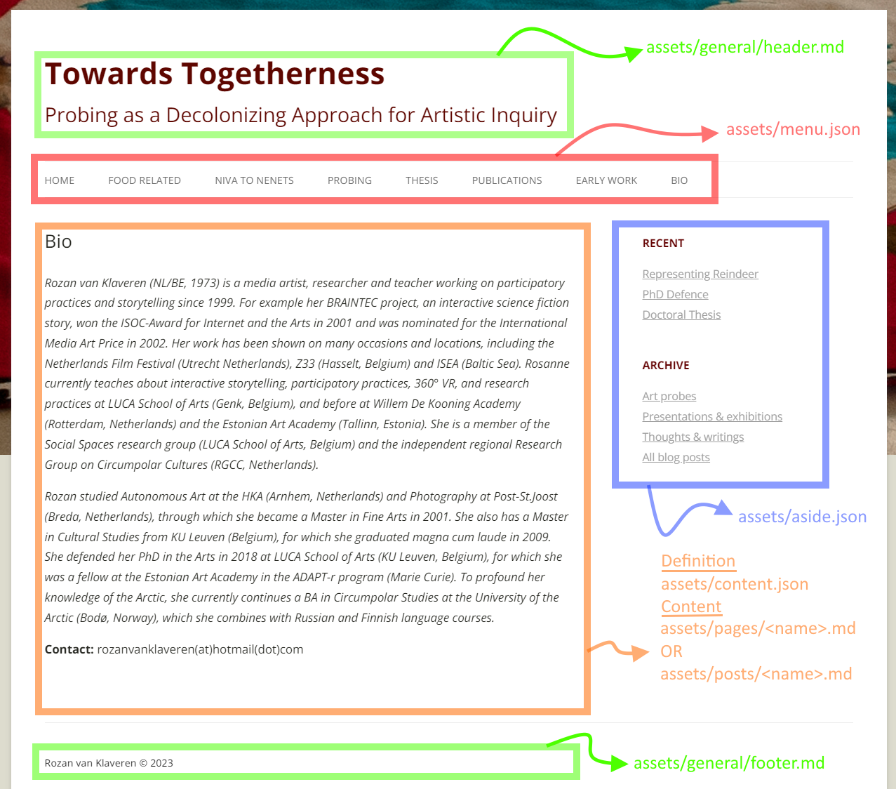
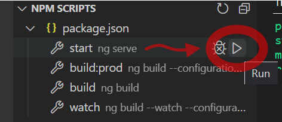
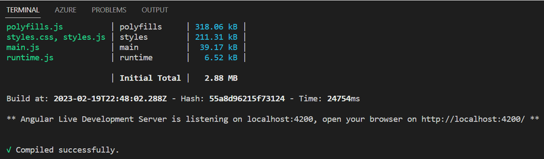

# Edit content

When editing files, all changes are saved automatically, no need to click save.

All content related files are in the folder:

> staticsite/src/assets

Don't change the files in the parent folders of the assets folder, unless you know what you are doing ;)

## Pages and posts
The pages and posts are in a simplyfied format called 'markdown' and have the file extension '.md'. They are located in the folders:

> staticsite/src/assets/pages

> staticsite/src/assets/posts

## Images and other media files
Images are stored in the folder:

> staticsite/src/assets/images

Other media files like zip, pdf, ... are stored in the folder:
> staticsite/src/assets/media

---

# Layout

---

# Testing on the local development server

To test changes to pages and posts before uploading them to the internet, run the command `ng serve`. The easiest way to do that is to click on the top button (Explorer) on the left hand side. The navigate into the sub menu called NPM scripts and click on the 'play' triangle button to the right of the menu item 'start'.

> 

Your project will be built and after a few minutes your can navigate to `http://localhost:4200/` to view your changes on the local development server.
> 

Once the build process is started it will keep on running and on every change to the pages, it will rebuilt the site automatically. You don't even need to refresh the browser as it will refresh automatically on every page or post change.

---

# Uploading the changes

When you are happy with the changes, you can send them to Github for publication.
- Click on the third button (Source control) of the left-hand side menu 
- Type a short informational message about your changes
- Click the 'Commit' button.
  - This will 'commit' your code LOCALLY only
- Click the 'Sync' button to send it to Github

It takes 3-5 minutes before your changes are published.
