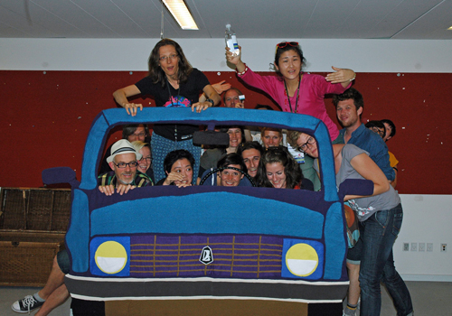

# Probing

Input of others is highly appreciated and searched for within my art and art making. For almost all projects that I worked for this far, I spent much time in creating, organizing and orchestrating conditions through which contributions of others are collected and shared. This includes, but is not limited to, opinions, viewpoints, words of advice and words of critique, questions, associations, anecdotes, memories and other kinds of experiences. Creatively and artistically I craft to support my inquiries. During my doctoral research, I discovered how this working approach is similar to probing. Many of the material objects I make reach out for contact and content, like probing devices, when I invite people to participate. As probes, they enable me to creatively and artistically explore certain topics, aims or situations. For example, the Mock-up Niva is an artistic impression of the front size of car, where people can sit behind and turn a steering wheel. This probe was designed to attract possible co-drivers for the Niva to Nenets road-movie, but turned strong in staging the imaginary world of the project during probing practices.

  

 
 
 
