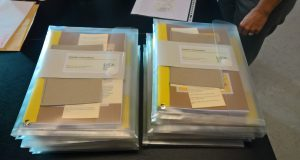

# Thesis

You are welcome to download a digital version of my thesis, or one of its chapters, below.

The thesis consists or five maps, bundled with a booklet for notes, a leaflet for references, and a summary in English and in Dutch. As this thesis is part of my artistic research, I have tried to strengthen the explorative character and multi-faceted content through its design. One can choose to follow specific trails throughout all maps and the notes booklet, by following directions and markers. The design carries on the same ‘look and feel’ as my probing practice. For example, the fabric on the spine of each map comes from the blankets of the Picnic-Quizzes. As the digital version is less strong in appearance and in reading experience, you are invited to contact me for obtaining a physical copy. 

  

- <a href="assets/media/Rosanne_vanKlaveren_Thesis.zip" target="_blank">download full thesis</a> (61,3MB)
- <a href="assets/media/Map1_Introduction.pdf" target="_blank">download Map 1 – Introduction</a> (4,5MB)
- <a href="assets/media/Map2_FoodRelated.pdf" target="_blank">download Map 2 – Food Related</a> (8,4MB)
- <a href="assets/media/Map3_NivaToNenets.pdf" target="_blank">download Map 3 – Niva to Nenets</a> (22,3MB)
- <a href="assets/media/Map4_Probology.pdf" target="_blank">download Map 4 – Probology</a> (11,8MB)
- <a href="assets/media/Map5_Discussion.pdf" target="_blank">download Map 5 – Discussion</a> (1,8MB)
- <a href="assets/media/Notes.pdf" target="_blank">download notes booklet</a> (2,5MB)
- <a href="assets/media/References.pdf" target="_blank">download references</a> (150KB)

**Summary:**  In the art-based PhD research *Towards Togetherness: Probing as a Decolonizing Approach for Artistic Inquiry*, participants were probed for their knowledge and guidance within two projects: the Food Related project and the Niva to Nenets project. Probology, which is an approach that uses probes to encourage subjective engagement, empathetic interpretation and a pervasive sense of uncertainty (Gaver), functioned as the guiding paradigm of this artistic inquiry. Decolonization processes set the stage, while actor network theory (ANT) inspired the practice. The probing was put in place with creative questionnaires, sets of cultural probes, props, Picnic-Quizzes, an online platform, and an interactive road-movie. 

The presented findings give possible answers to the question how probing art can establish connections between people(s) to stimulate knowledge sharing. Probology opened up the creation process for participation and enhanced the inclusion of different, sometimes opposing, viewpoints. shared creativity, commensality, ambiguity and imagination are among the key values of the probing practices. Special attention is given to the role of the artist acting out the probing. This role is multiple in essence, as it includes the initiation, organization, creation, approach, moderation, artistry, presentation, and more. In all its various aspects lies a possibility to decolonize, and to experience a temporary feeling of togetherness.

- **Promotor:** Prof. Patrick Devlieger
- **Co-promotor:** Prof. Liesbeth Huybrechts
- **Additional supervisors:** Dr. Veerle Van der Sluys, Dr. Cunera Buijs, Jeroen Toirkens.

 
 
 
